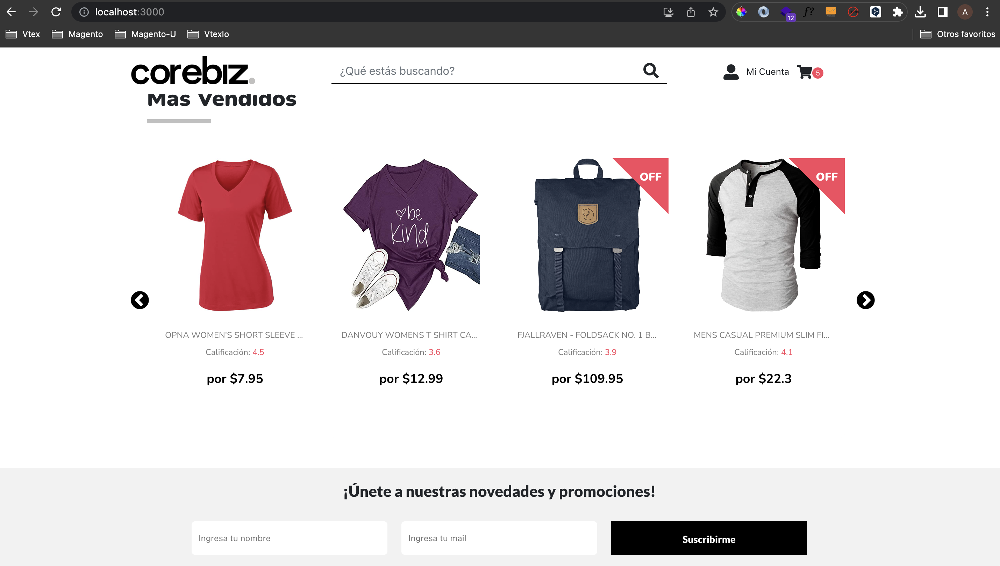

# Test Front-end 

This is a README for an HTML, CSS and Javascript application development project, based on React JS.

## Index

1. [Description](#TestFront-end)
2. [Installation](#Installation)
3. [Features](#Features)
3. [Technologies](#Technologies)
4. [Contact](#Contact)

## Installation

1. Clone this project
2. Go to the Test-Front-End file
3. Install dependencies `npm install`
4. Run the app in development mode. Open http://localhost:3000  `npm start`

## Features

- Responsive Design
- Add product to minicart
- Banner carousel and product carosuel
- Newsletter registration
- Fetching data with Fetch (get and post methods)

## Technologies
- HTML
- CSS
- Javascript
- React JS
- React hooks
- React Bootstrap
- React icons
- Google fonts

## Contact information
If you have any questions, suggestions, or issues, please contact the project owner at anadev.glz@gmail.com

